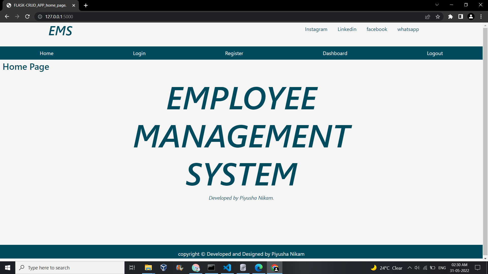
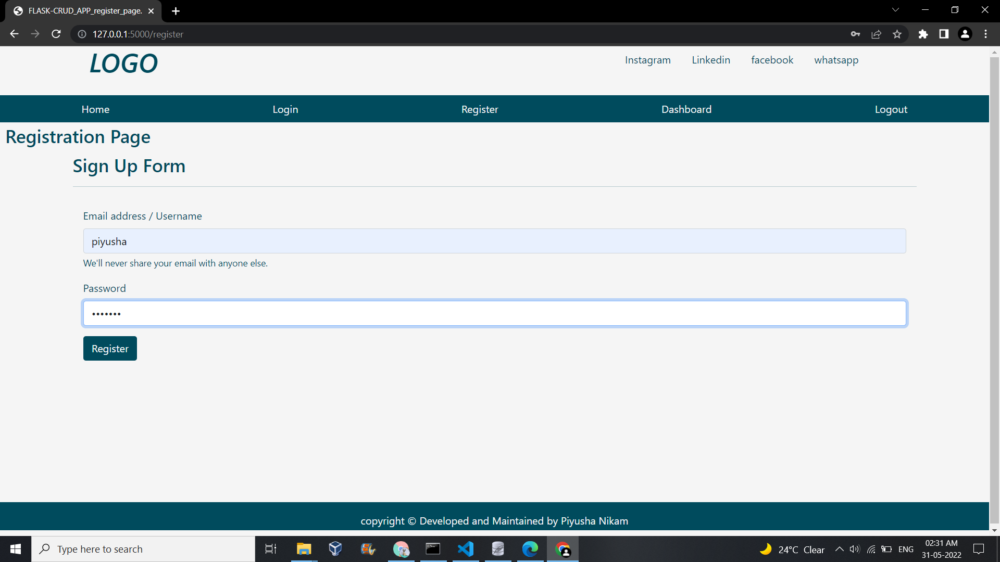
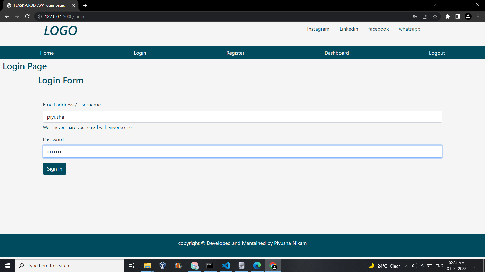
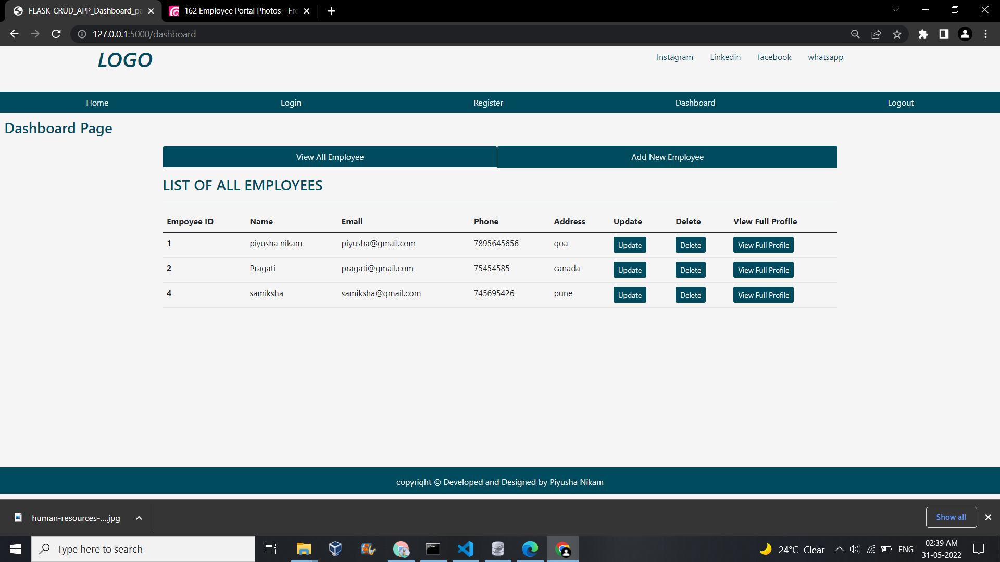
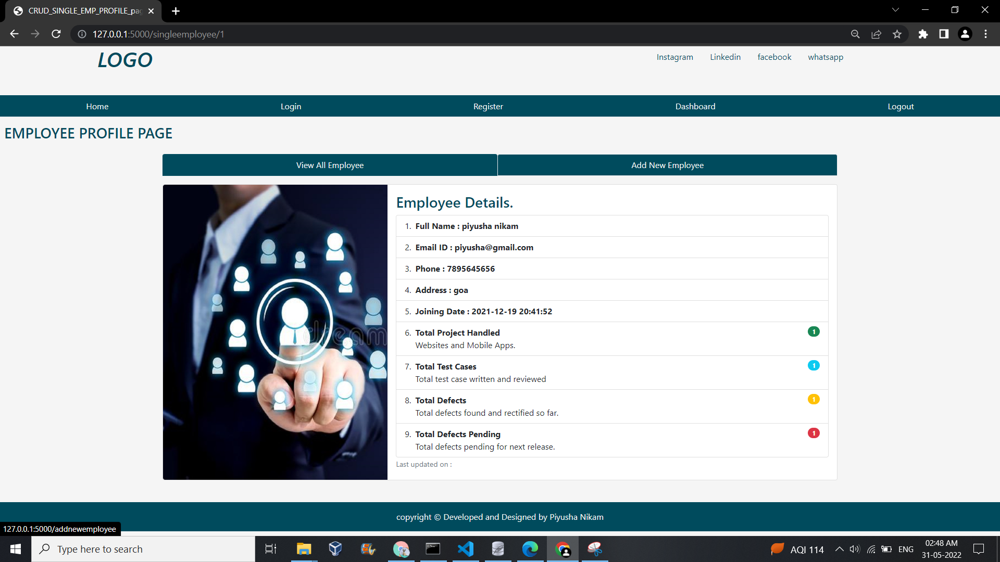
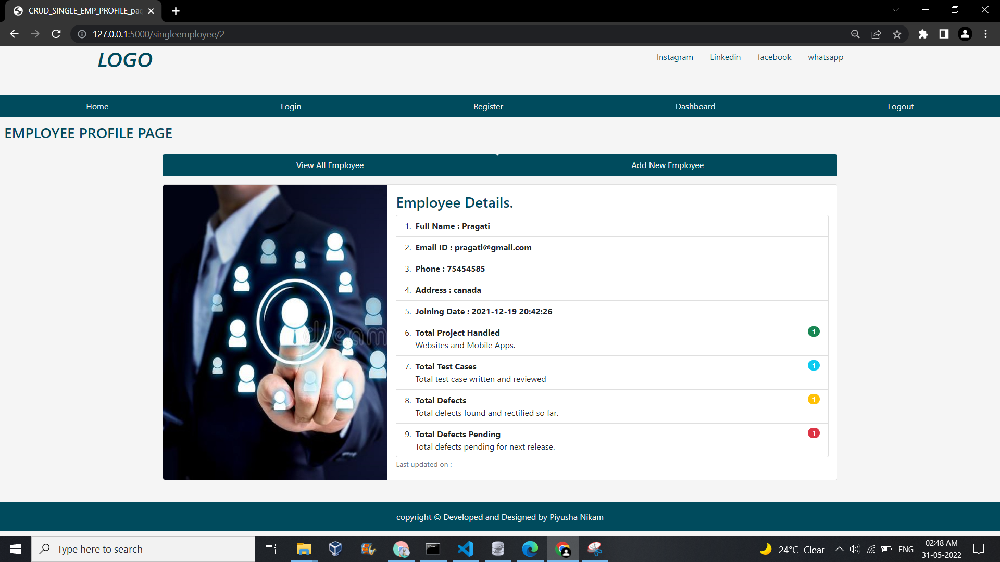

# EMPLOYEE MANAGEMENT SYSTEM
EMPLOYEE MANAGEMENT SYSTEM

Requirement
--------------------------------------------
1. Windows (windows 10 is best)
2. Python 3

create vertual environment or run directly.

python main.py

Dependencies and requirements :
System requirements: Python 3.9, Visual Studio Code
Install all these python libraries:
            
            pip install flask
            pip install sqlite3
           

## OUTPUT

## HOME

## SIGN UP

## LOGIN

## EMPLOYEE

## EMPLOYEES

## DATABASE

